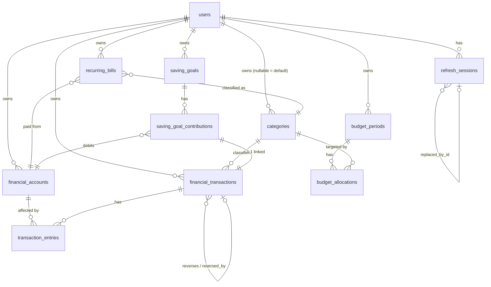

# Database Model

Source: `services/api/db/migrations/00001_core.sql` — the **only** migration in the repository (single-file schema, applied via Goose). See [[Migrations]] for migration mechanics and [[Financial Invariants]] for the business rules these constraints enforce.

## Entity-relationship diagram

## Tables

### `users`
`id` (PK, uuid) · `email` (`citext`, unique) · `display_name` · `password_hash` · `status` (enum: active/suspended/deletion_pending/deleted) · `role` (enum: user/super_admin/operations_admin/support_agent/auditor) · `currency` (char(3), default `IDR`) · `timezone` (default `Asia/Jakarta`) · `payday` (smallint, CHECK 1–31) · `minimum_buffer` (bigint, CHECK ≥0) · `ai_consent` (bool) · `created_at`/`updated_at`. No FKs (root table). No `archived_at` — lifecycle handled via the `status` enum.

### `refresh_sessions` — see [[Authentication and Sessions]]
`id` · `user_id` FK · `family_id` · `token_hash` (char(64), **unique**) · `replaced_by_id` (self-FK, nullable — rotation chain) · `expires_at` · `revoked_at` (nullable) · `user_agent` · `ip_address` (`inet`) · `created_at`. Indexes: `(user_id, created_at DESC)`, `(family_id)`.

### `financial_accounts`
`id` · `user_id` FK · `name` · `type` (enum: cash/bank/ewallet/savings/other) · `currency` · `initial_balance` (bigint, CHECK ≥0) · `spendable` (bool, default true) · `archived_at` (nullable — soft-delete) · `created_at`/`updated_at`. Unique index: `(user_id, lower(name)) WHERE archived_at IS NULL` (case-insensitive active-name uniqueness per user).

### `categories`
`id` · `user_id` FK (**nullable** — `NULL` = system default) · `name` · `kind` (enum: income/expense) · `icon` · `is_default` (bool) · `archived_at` (nullable) · `created_at`/`updated_at`. CHECK: `(is_default AND user_id IS NULL) OR (NOT is_default AND user_id IS NOT NULL)`. 9 default categories are seeded with fixed UUIDs. Unique indexes scope default names by `(kind, lower(name))` and user names by `(user_id, kind, lower(name))`, both filtered to non-archived rows.

### `financial_transactions` — ledger header, see [[Financial Ledger]]
`id` · `user_id` FK · `type` (enum: income/expense/transfer/adjustment/reversal) · `category_id` FK (nullable) · `amount` (bigint, CHECK >0) · `occurred_at` · `note` · `reason` · `reverses_id` (self-FK, nullable) · `reversed_by_id` (self-FK, nullable) · `idempotency_operation` · `idempotency_key` · `request_hash` (char(64)) · `created_at` (no `updated_at` — ledger rows are append-only/immutable). Unique: `(user_id, idempotency_operation, idempotency_key)`. Indexes: `(user_id, occurred_at DESC, id DESC)`, `(user_id, category_id, occurred_at)`.

### `transaction_entries` — ledger legs
`id` · `transaction_id` FK (**ON DELETE CASCADE**) · `account_id` FK · `direction` (enum: credit/debit) · `amount` (bigint, CHECK >0). No audit timestamps (immutable child rows). Index: `(account_id, transaction_id)`.

### `budget_periods`
`id` · `user_id` FK · `start_date`/`end_date` (date, CHECK end≥start) · `expected_income`/`savings_commitment`/`minimum_buffer` (bigint, CHECK ≥0) · `status` (enum: draft/active/closed) · `source` (enum: manual/rule_based/ai_assisted) · `created_at`/`updated_at`. **`budget_periods_no_overlapping_active`**: a Postgres `EXCLUDE USING gist` constraint (needs `btree_gist` extension) preventing two overlapping **active** periods per user — enforces `BUD-002` at the database level, not just in application code.

### `budget_allocations`
`id` · `budget_period_id` FK (**ON DELETE CASCADE**) · `category_id` FK · `amount` (bigint, CHECK ≥0). Unique: `(budget_period_id, category_id)`.

### `recurring_bills`
`id` · `user_id` FK · `name` · `amount` (bigint, CHECK >0) · `due_day` (smallint, CHECK 1–31) · `frequency` (enum: weekly/monthly/yearly) · `category_id` FK · `account_id` FK · `reminder_days` (smallint, CHECK 0–90, default 3) · `active` (bool — lifecycle flag, not `archived_at`) · `created_at`/`updated_at`. Index: `(user_id, active)`.

### `saving_goals`
`id` · `user_id` FK · `name` · `target_amount` (bigint, CHECK >0) · `target_date` (nullable) · `monthly_commitment` (bigint, CHECK ≥0) · `priority` (smallint) · `status` (enum: active/completed/archived) · `created_at`/`updated_at`. Unique: `(user_id, lower(name)) WHERE status <> 'archived'`.

### `saving_goal_contributions`
`id` · `goal_id` FK · `user_id` FK · `account_id` FK · `amount` (bigint, CHECK >0) · `occurred_at` · `transaction_id` FK (**unique** — 1:1 link to its ledger transaction) · `created_at`. Index: `(goal_id, occurred_at)`.

### `audit_logs`
`id` · `actor_type` · `actor_id` · `action` · `target_type` · `target_id` · `request_id` · `reason` · `metadata` (`jsonb`) · `occurred_at`. Indexes: `(actor_type, actor_id, occurred_at DESC)`, `(target_type, target_id, occurred_at DESC)`. No FKs — actor/target are loosely typed strings, not foreign keys, so this table can reference any entity type.

## Cross-cutting patterns

| Pattern | Where used |
|---|---|
| Ownership (`user_id`) | `refresh_sessions`, `financial_accounts`, `categories` (nullable), `financial_transactions`, `budget_periods`, `recurring_bills`, `saving_goals`, `saving_goal_contributions` |
| Soft-delete via `archived_at` | `financial_accounts`, `categories` |
| Soft-delete via `active` flag | `recurring_bills` |
| Soft-delete via `status` enum | `saving_goals` (`archived`), `users` (`deletion_pending`/`deleted`) |
| Immutable append-only | `financial_transactions` (no `updated_at`), `transaction_entries`, `budget_allocations` (no audit fields at all) |
| Idempotency storage | inline on `financial_transactions` (no separate table) |
| Refresh-token storage | `refresh_sessions.token_hash` (hash only, never plaintext) |

## Related notes

- [[Migrations]]
- [[Financial Invariants]]
- [[Financial Ledger]]
- [[Authentication and Sessions]]
- [[SakuPlan]]
