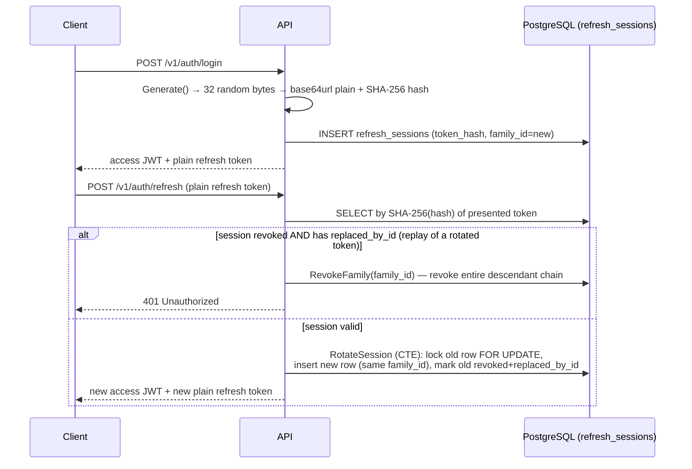

# Authentication and Sessions

Source: `internal/adapters/security/{password,token}.go`, `internal/application/auth.go`, `internal/adapters/postgres/store.go` (`RotateSession`), `db/migrations/00001_core.sql` (`refresh_sessions`).

## Password hashing — Argon2id

`security.DefaultArgon2Config()`: Memory = 64 MiB (65536 KiB), Iterations = 3, Parallelism = 2, Salt = 16 bytes, Key = 32 bytes. Encoded as a PHC-like string: `$argon2id$v=<version>$m=<memory>,t=<iterations>,p=<parallelism>$<base64 salt>$<base64 key>`. Verification uses `crypto/subtle.ConstantTimeCompare` (timing-attack resistant). Parameters are fixed, not configurable via env vars.

## Access tokens — JWT (HS256)

- Library: `github.com/golang-jwt/jwt/v5`.
- Claims: standard registered claims (`iss`, `sub`, `aud`, `exp`, `iat`, `nbf`) + custom `role` claim. `Subject` carries the user ID.
- `Issue`: `NotBefore = now − 5s` (clock-skew allowance); signed HS256 with `JWT_SECRET`.
- `Parse`: restricted to `HS256` via `jwt.WithValidMethods` (defends against alg-confusion attacks) with a second explicit algorithm check in the keyfunc; validates issuer, audience, and requires an expiration claim; uses an **injectable time function** tied to the app's `Clock` port (not wall-clock) — testable and consistent with the rest of the system's time handling.
- Any parse failure (or empty subject) collapses uniformly to `domain.ErrUnauthorized` — no detail leaked.
- `JWT_SECRET` must be ≥32 characters, checked both in `config.Load()` and independently inside `security.NewJWTManager`.

## Refresh tokens — opaque, rotating, hash-stored

- Refresh token = 32 random bytes (`crypto/rand`), base64url-encoded (no padding) → 256 bits of entropy.
- Stored as `token_hash = SHA-256(plain)` hex digest — **the plaintext is never persisted** (confirmed by `TestRefreshManagerNeverStoresPlainToken`).
- **Rotation**: `RotateSession` in `postgres/store.go` uses a single CTE (`WITH eligible AS (... FOR UPDATE), inserted AS (...)`) to atomically lock the old row, insert the replacement, and mark the old row `revoked_at` + `replaced_by_id` — all in one statement, race-safe under concurrent refresh attempts (`FOR UPDATE` causes a competing rotation to fail with `ErrConflict`).
- **Family/reuse detection**: every login starts a new `family_id`; every rotation carries the same `family_id` forward. If a token that was already rotated (`RevokedAt != nil && ReplacedByID != ""`) is presented again — meaning it was stolen and replayed after the legitimate client already rotated — the **entire family** is revoked via `RevokeFamily`, invalidating every descendant session in that chain, not just the replayed token.
- `Logout` revokes a single session (silently no-ops if not found, treated as intentional/idempotent per `docs/P0_GAP_ANALYSIS.md`'s `nilerr` lint note). `LogoutAll` revokes every session for the user.

## Schema (`refresh_sessions`)

`id`, `user_id` (FK), `family_id`, `token_hash CHAR(64) UNIQUE`, `replaced_by_id` (self-FK, nullable), `expires_at`, `revoked_at` (nullable), `user_agent`, `ip_address` (`inet`), `created_at`. Indexes: `(user_id, created_at DESC)`, `(family_id)`.

## Configuration

| Env var | Default | Notes |
|---|---|---|
| `JWT_SECRET` | — (required, ≥32 chars) | HMAC key |
| `JWT_ISSUER` | `sakuplan-api` | |
| `JWT_AUDIENCE` | `sakuplan-client` | |
| `ACCESS_TOKEN_TTL` | `15m` | Go duration string |
| `REFRESH_TOKEN_TTL` | `720h` (30 days) | Go duration string |

## Known limitation

`role` (`domain.UserRole`) is issued in the JWT and stored in Fiber `Locals` by `requireAuth`, but **no middleware or handler currently reads it** — there is no role/permission enforcement anywhere. Admin authentication (`AUTH-006`) is unimplemented. See [[Authorization and Ownership]] and [[Security Controls]].

## Related notes

- [[Authorization and Ownership]]
- [[Security Controls]]
- [[Authentication API]]
- [[ADR-011]]
- [[SakuPlan]]
