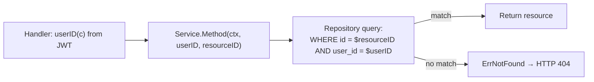

# Authorization and Ownership

Source: `internal/adapters/httpapi/server.go` (`requireAuth`, `userID`), `internal/domain/repositories.go`, `internal/application/*`.

## Authentication middleware (`requireAuth`)

Applied only to the `secured` sub-group of `/v1` (not global). Requires a case-insensitive `Bearer ` prefix on `Authorization`; parses via the injected `ports.AccessTokenManager`; stores `user_id` and `role` in Fiber `Locals`. Any parse failure → `domain.ErrUnauthorized` (401). `userID(c)` is a simple type-asserted `Locals` read used by every handler.

## Ownership model — implicit, via scoped queries, not a separate permission check

There is **no dedicated authorization/ownership error type** in active use. `domain.ErrForbidden` exists as a sentinel but has no call site found in `internal/application`. Instead, every repository method that returns or mutates a user-owned resource takes the caller's `userID` as a parameter and scopes the SQL query by it — a cross-user reference simply doesn't match any row and surfaces as `domain.ErrNotFound` (404), not a distinct 403.

Confirmed by `ownership_test.go`:
- `TestBudgetRejectsAnotherUsersCategory` — allocating a budget to another user's category → `errors.Is(err, domain.ErrNotFound)`.
- `TestBillRejectsAnotherUsersAccount` — creating a bill against another user's account → same pattern.

This means an attacker probing another user's resource ID gets an indistinguishable-from-nonexistent 404 rather than a 403 — arguably a reasonable anti-enumeration choice, but it also means there is no separate audit signal for "attempted cross-user access" vs. "requested a resource that doesn't exist."

## Role-based access — issued but unenforced

The JWT `role` claim (`domain.UserRole`: `user`, `super_admin`, `operations_admin`, `support_agent`, `auditor`) is set in `Locals` by `requireAuth` but **no middleware or handler reads it**. There is no `requireRole`/`requirePermission` middleware anywhere in `internal/adapters/httpapi`. This is the direct cause of `AUTH-006`/`ADM-001..006` being unimplemented — see [[Security Controls]] and [[Remaining Work]].

## Category ownership nuance

`categories.user_id` is **nullable** — `NULL` denotes a system default category shared across all users (seeded, `is_default=true`). Ownership checks in `CategoryService`/`BudgetService` must account for this: a default category is valid for any user to reference, while a custom category is scoped strictly to its creator.

## Related notes

- [[Authentication and Sessions]]
- [[Security Controls]]
- [[Backend Modules]]
- [[Database Model]]
- [[SakuPlan]]
