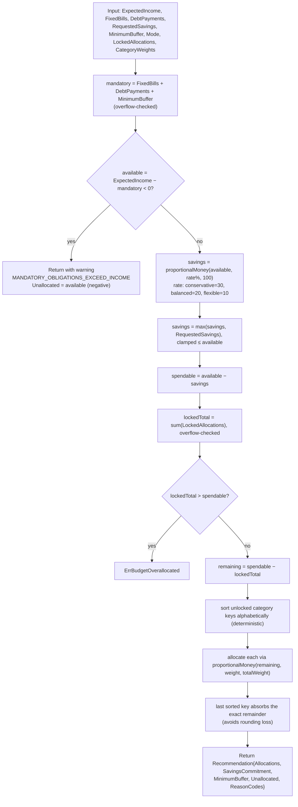

# Budget Recommendation Engine

Source: `internal/application/planning.go`, `RecommendationService.Generate` (lines ~99-186). Requirement IDs: `REC-001`–`REC-007` in [[Product Requirements]]. `REC-001` ("deterministic first") is satisfied by construction — `RecommendationService` has **zero repository/port dependencies**; `Generate` is a pure function of its input.

## Algorithm (exact, from source)



## Savings rate by mode

| Mode | Rate |
|---|---|
| `conservative` | 30% |
| `balanced` (default/empty) | 20% |
| `flexible` | 10% |
| anything else | `ErrInvalidInput` |

## Default category weights (used if none supplied)

`{"food": 40, "transport": 20, "household": 20, "health": 10, "lifestyle": 10}` — weights are validated 0–10,000 each; cumulative weight capped at 1,000,000 to prevent overflow.

## Money-conservation invariant

Every allocation run must satisfy:

```
SavingsCommitment + MinimumBuffer + FixedBills + DebtPayments + Unallocated + sum(Allocations) == ExpectedIncome
```

Verified by `TestRecommendationIsDeterministicAndConservesMoney` (also checks calling `Generate` twice with identical input yields identical output — determinism) and `TestRecommendationAllocatesRemainderWhenLastSortedCategoryIsLocked` (confirms `Unallocated == 0` even with rounding-prone weights, since the alphabetically-last **unlocked** key absorbs the remainder).

## Overflow safety

`TestRecommendationHandlesMaximumMoneyWithoutOverflow` confirms conservation holds at `math.MaxInt64`. `TestRecommendationRejectsMandatoryTotalOverflow` confirms `FixedBills = MaxInt64, DebtPayments = 1` is rejected with `ErrInvalidInput` rather than silently wrapping — via `addNonNegativeMoney` in `internal/application/money_math.go`, shared with [[Financial Ledger]] and [[Backend Modules#Budgets — BudgetService|BudgetService]].

## Validation parity (`REC-005`)

Recommendations are computed by a pure function and are **not automatically validated against `BudgetService.validateBudget`** — the caller would need to submit the resulting allocations through `POST /v1/budgets` to get that validation. There is no code path that runs recommendation output through the budget validator automatically.

## AI explanation layer (`REC-007`) — not implemented

The PRD describes an optional adapter that turns the deterministic `ReasonCodes` into natural-language text, treated as untrusted presentation text with a template-based fallback on failure. No such adapter exists in `internal/` today — see [[Remaining Work]] and [[ADR-010]].

## Related notes

- [[Backend Modules]]
- [[Safe-to-Spend Engine]]
- [[Financial Invariants]]
- [[Recommendations API]]
- [[ADR-010]]
- [[SakuPlan]]
