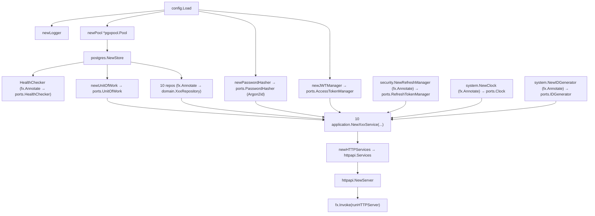

# Dependency Injection

Source: `services/api/internal/bootstrap/app.go`, `services/api/cmd/api/main.go`.

## Constructor injection everywhere except the composition root

Every `internal/application` service takes only interfaces (`domain.XxxRepository`, `ports.Xxx`) as constructor parameters — plain Go, no framework. Example: `NewTransactionService(txs domain.TransactionRepository, accounts domain.AccountRepository, categories domain.CategoryRepository, uow ports.UnitOfWork, clock ports.Clock, ids ports.IDGenerator)`. Tests instantiate these directly with fakes — no Fx needed for unit tests. See [[ADR-004]].

## Uber Fx — composition root only

`internal/bootstrap/app.go` is the **only** place Fx assembles concrete dependencies (`cmd/api/main.go` is 7 lines: `bootstrap.New().Run()`). One `fx.New(...)` call with ~32 providers and a single `fx.Invoke(runHTTPServer)`.



### Provider list (in registration order)

`config.Load` → `newLogger` → `newPool` (+`OnStop`: close pool) → `postgres.NewStore` → `HealthChecker` (annotated) → `Clock`, `IDGenerator` (annotated) → `newPasswordHasher` → `newJWTManager` → `RefreshManager` (annotated) → `newUnitOfWork` (wraps `*postgres.Store`) → 9 repository adapters (annotated as their `domain.XxxRepository` interface: User, Session, Account, Category, Transaction, Budget, Bill, Goal, Audit) → `newAuthService` → `NewUserService`/`NewAccountService`/`NewCategoryService`/`NewTransactionService`/`NewBudgetService`/`NewBillService`/`NewGoalService`/`NewPlanningService`/`NewRecommendationService` → `newHTTPServices` (struct assembly) → `httpapi.NewServer`.

Then: `fx.Invoke(runHTTPServer)` triggers construction of the whole graph.

## Lifecycle and graceful shutdown

```go
// internal/bootstrap/app.go (paraphrased structure, not verbatim)
func runHTTPServer(lc fx.Lifecycle, server *httpapi.Server, cfg config.Config, logger *slog.Logger) {
    lc.Append(fx.Hook{
        OnStart: func(context.Context) error {
            go server.App().Listen(cfg.HTTPAddress, fiber.ListenConfig{DisableStartupMessage: true})
            return nil
        },
        OnStop: func(context.Context) error {
            return server.App().ShutdownWithTimeout(cfg.ShutdownTimeout)
        },
    })
}
```

- `OnStart` launches Fiber's `Listen` in a goroutine — non-blocking, so Fx doesn't wait for the server to actually be accepting connections before considering startup "complete."
- `OnStop` calls Fiber's own `ShutdownWithTimeout(cfg.ShutdownTimeout)` (default 10s, from `SHUTDOWN_TIMEOUT`) — stops accepting new connections, drains in-flight requests, force-closes after the timeout.
- The DB pool's `OnStop` (registered earlier, in `newPool`) closes the pgx pool. Fx runs `OnStop` hooks in **reverse registration order**, so the HTTP-drain hook (registered later) runs *before* the pool-close hook — correct ordering, since in-flight requests need the DB pool alive while draining.
- `main.go`'s `bootstrap.New().Run()` is Fx's own blocking run-until-signal helper (SIGINT/SIGTERM). No explicit `fx.StopTimeout` option is set, so Fx's internal default stop-context timeout applies on top of `cfg.ShutdownTimeout`.

## Notable fixed bug (documented in PROGRESS.md)

`fiber.Config.DisableStartupMessage` doesn't exist in the pinned `fiber/v3 v3.4.0` — it moved to `fiber.ListenConfig`, passed to `App.Listen(...)`. This was a genuine source/API mismatch (not an environment issue), fixed by moving the field and adding the Fiber import to `bootstrap/app.go` ("bootstrap is a composition root, where Fiber imports are permitted").

## Related notes

- [[System Architecture]]
- [[Repository Structure]]
- [[Backend Modules]]
- [[ADR-004]]
- [[SakuPlan]]
