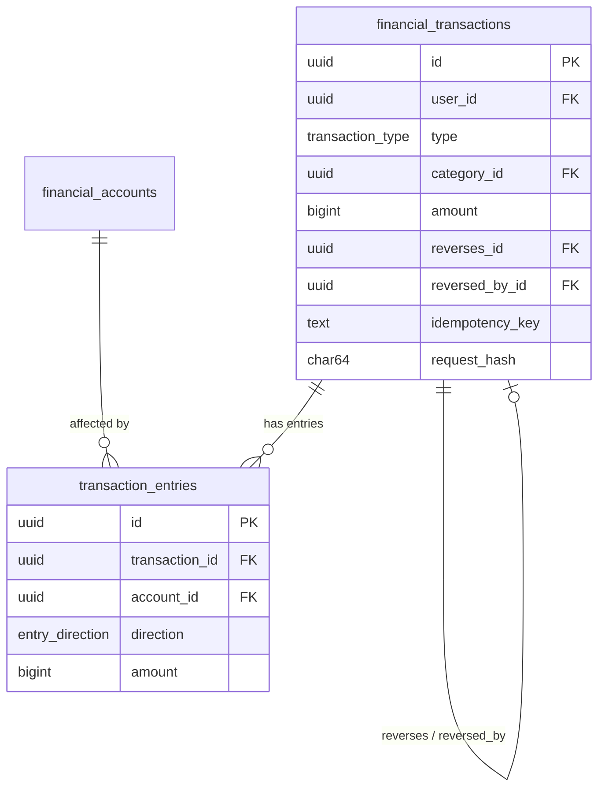
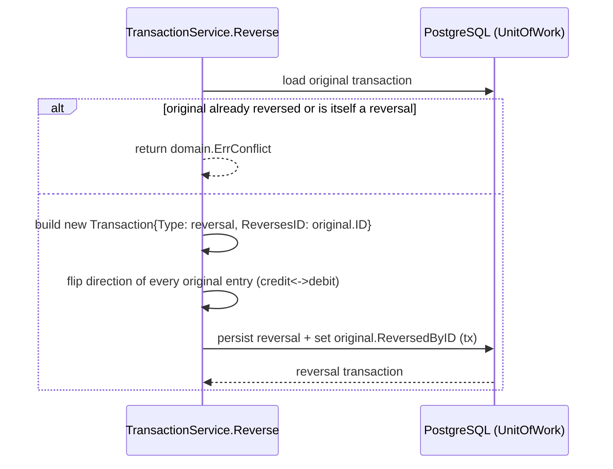
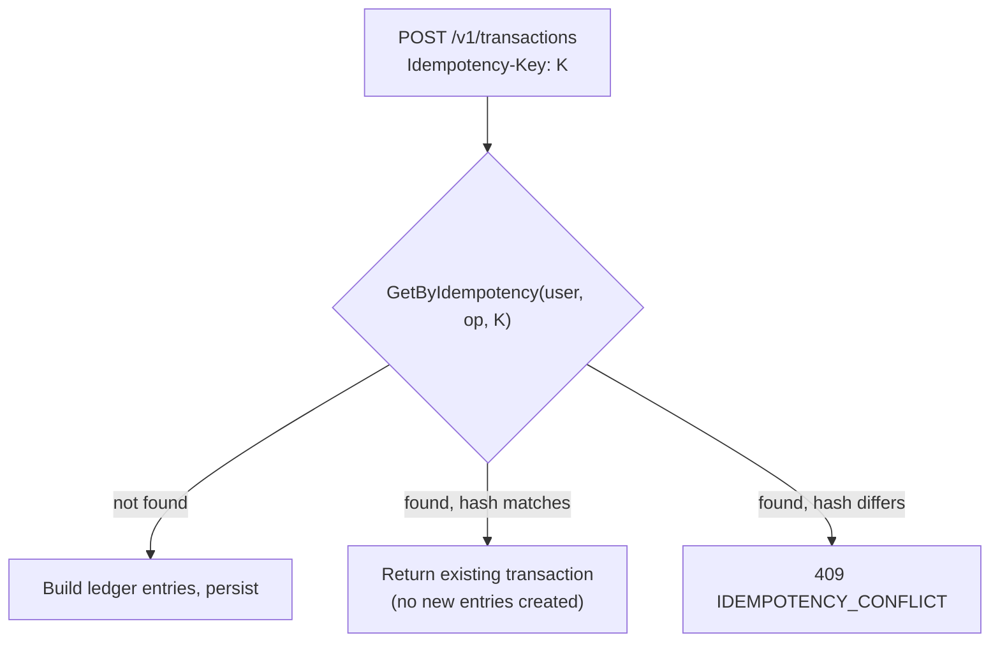

# Financial Ledger

Source: `internal/domain/entities.go`, `internal/application/transactions.go`, `internal/adapters/postgres/store.go`, `db/migrations/00001_core.sql`. See [[Database Model]] for the table-level schema and [[Financial Invariants]] for the cross-module invariant summary.

## Model

A **transaction** (`financial_transactions`) is a business event; a **transaction entry** (`transaction_entries`) is a signed effect on one account. This is a hybrid, not a full double-entry general ledger (PRD §11 calls it "hybrid double-entry-inspired").

## Entries by transaction type (`internal/application/transactions.go`, `Create`)

| Type | Entries created | Category required |
|---|---|---|
| `income` | 1 credit on source account | yes, kind=income, not archived |
| `expense` | 1 debit on source account | yes, kind=expense, not archived |
| `transfer` | 1 debit (source) + 1 credit (destination), same amount | no — requires `DestinationID ≠ AccountID`, same currency, destination not archived |
| `adjustment` | 1 entry; direction from string convention — `Reason` prefixed `"debit:"` → debit, else credit | no, but `Reason` is mandatory |
| `reversal` | offsetting entries for every original entry, direction flipped | inherited from original |

Amount validation: `Amount ≤ 0` is rejected before any entry is built (`domain.ErrInvalidAmount`-equivalent path). All monetary fields are `domain.Money` = `int64` minor units — see [[ADR-008]].

## Account balance reconstruction

No running balance column exists. `financial_accounts.initial_balance` plus a signed sum over `transaction_entries` (credit = `+amount`, debit = `−amount`) computed in SQL at query time (`AccountBalance`/`LiquidBalance` in `postgres/store.go`). This matches PRD `ACC-003`'s stated formula exactly. There is no cached/snapshot balance column — PostgreSQL (the ledger) is the sole source of truth. See [[ADR-012]].

## Reversal — immutable, one-time

- The original row is **never mutated or deleted** — reversal creates a brand-new `financial_transactions` row (`type=reversal`) linked via `reverses_id`/`reversed_by_id` (a self-referential FK pair on the same table, not a separate table).
- A transaction can be reversed **exactly once**: `original.Type == reversal || original.ReversedByID != ""` → `ErrConflict` (verified by `TestReverseTransactionRejectsSecondReversal`).
- Reversal itself is idempotent under the same `Idempotency-Key` semantics as creation (operation `"transaction.reverse"`).
- Verified by `TestReverseTransactionRestoresBalanceAndIsIdempotent`: reversing a 100,000 expense restores the account to its pre-expense balance exactly.

## Idempotency and payload-hash conflict detection

- `operation` key = `"transaction.create.<type>"` (namespaced per transaction type) or `"transaction.reverse"` or `"goal.contribute"` for goal contributions.
- `hash` = SHA-256 hex digest of the JSON-canonicalized input struct (`canonicalHash` in `transactions.go`) — this is the payload hash referenced by `BR-009`.
- Storage: `financial_transactions.idempotency_operation` + `.idempotency_key` + `.request_hash`, enforced unique via `UNIQUE(user_id, idempotency_operation, idempotency_key)` — no separate idempotency-records table.
- Confirmed by `TestIdempotencyReturnsOriginalAndRejectsPayloadChange`: same key + same payload replayed twice → same transaction ID, zero side effects on retry; same key + changed amount → `ErrIdempotencyConflict`, balance unchanged.

## SQL transaction boundaries

`ports.UnitOfWork.WithinTransaction(ctx, func(ctx) error)` — implemented by `postgres.Store` itself (it satisfies the interface directly). Nested-transaction-safe: `Store` methods check `inTransaction(ctx)` first and only open a new `pgx.Tx` if not already inside one, avoiding nested `BeginTx` calls. Isolation level is Postgres default (read committed) — no explicit `pgx.TxOptions` override found. Used by `TransactionService.Create`/`Reverse` and `GoalService.Contribute`; **not** used by `AccountService`, `CategoryService`, or `BudgetService` (single-aggregate writes only).

## Overflow protection

`internal/application/money_math.go`:
- `addNonNegativeMoney(values ...Money) (Money, bool)` — rejects negatives, detects int64 overflow before it happens (`total > MaxInt64 - value`) instead of wrapping.
- `proportionalMoney(amount, numerator, denominator)` — computes `amount * numerator / denominator` via quotient/remainder decomposition to avoid overflow when multiplying large values directly.

Both are exercised at `math.MaxInt64` by `TestRecommendationHandlesMaximumMoneyWithoutOverflow` and `TestBudgetRejectsOverflowingAllocationTotal`.

## Related notes

- [[Database Model]]
- [[Financial Invariants]]
- [[Backend Modules]]
- [[Transactions API]]
- [[ADR-006]]
- [[ADR-007]]
- [[ADR-008]]
- [[SakuPlan]]
