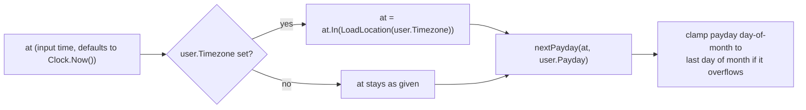

# Safe-to-Spend Engine

Source: `internal/application/planning.go`, `PlanningService.SafeToSpend` (lines ~25-73). Requirement IDs: `STS-001`–`STS-007` in [[Product Requirements]].

## Formula (exact, from source)

```
UntilPayday = LiquidBalance − UpcomingBills − RemainingSavingsCommitment − MinimumBuffer
DaysRemaining = floor(hours(payday − startOfDay(now)) / 24) + 1     (minimum 1)
Daily = UntilPayday / DaysRemaining
```

- **LiquidBalance**: `AccountRepository.LiquidBalance(userID)` — sum over spendable accounts (savings-type accounts excluded unless marked spendable, per `STS-004`).
- **UpcomingBills**: `BillRepository.UpcomingTotal(userID, now, payday)`.
- **RemainingSavingsCommitment**: `GoalRepository.RemainingMonthlyCommitment(userID, now)`, **overridden upward** if the user's active budget's `SavingsCommitment` is higher.
- **MinimumBuffer**: `user.MinimumBuffer`, **overridden upward** if the active budget's `MinimumBuffer` is higher.
- If no active budget exists (`ErrNotFound`), the user-level defaults are used as-is; any other repo error is returned unwrapped.

## Timezone and payday handling



- `user.Timezone` (default `Asia/Jakarta`, user-editable) is loaded via `time.LoadLocation`; an invalid timezone string returns `ErrInvalidInput` rather than silently falling back to UTC.
- `nextPayday` rolls to next month if today is on/after this month's payday; `dateWithClampedDay` clamps a payday like `31` to the actual last day of a short month (`USER-002`).
- `startOfDay` truncates to midnight in the resolved location.

## Risk levels

| Condition | `RiskLevel` |
|---|---|
| `UntilPayday < 0` | `"high"` |
| `UntilPayday ≥ 0` and `Daily == 0` | `"attention"` |
| otherwise | `"healthy"` |

Negative safe-to-spend is returned as-is, not clamped to zero (`STS-005`).

## Verified by tests

- `TestSafeToSpendProtectsBillsSavingsAndBuffer`: liquid=5,000,000, bills=1,000,000, goals-remaining=500,000, buffer=250,000 → `UntilPayday == 3,250,000` (exact arithmetic), `DaysRemaining == 2`.
- `TestSafeToSpendUsesUserTimezone`: 18:00 UTC on the 24th = 01:00 WIB on the 25th (already past this month's payday in the user's zone) → correctly rolls to next month, `DaysRemaining ≥ 30`.

## Explainability (`STS-006`)

The `SafeToSpend` response struct (`domain.SafeToSpend`) exposes every component used in the calculation: `LiquidBalance`, `UpcomingBills`, `RemainingSavingsCommitment`, `MinimumBuffer`, `UntilPayday`, `Daily`, `DaysRemaining`, `RiskLevel` — see [[Recommendations API]] for the response shape returned over HTTP.

## Related notes

- [[Backend Modules]]
- [[Financial Invariants]]
- [[Recommendations API]]
- [[Budget Recommendation Engine]]
- [[SakuPlan]]
