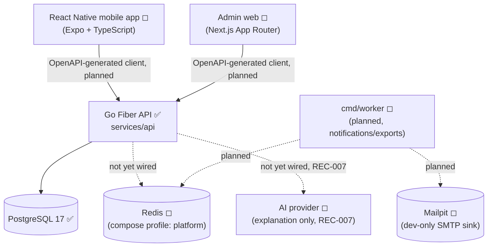
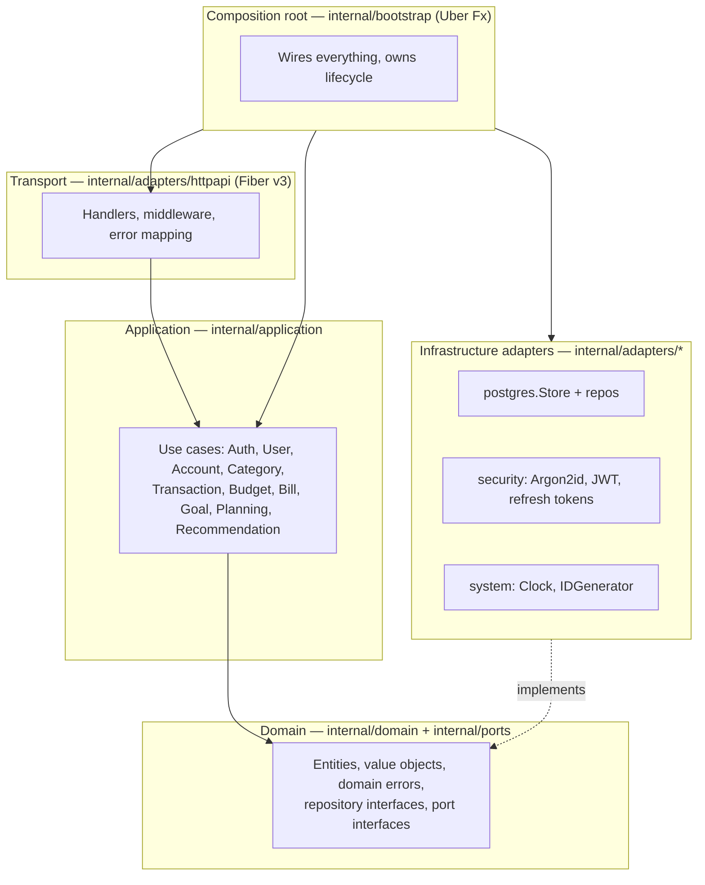
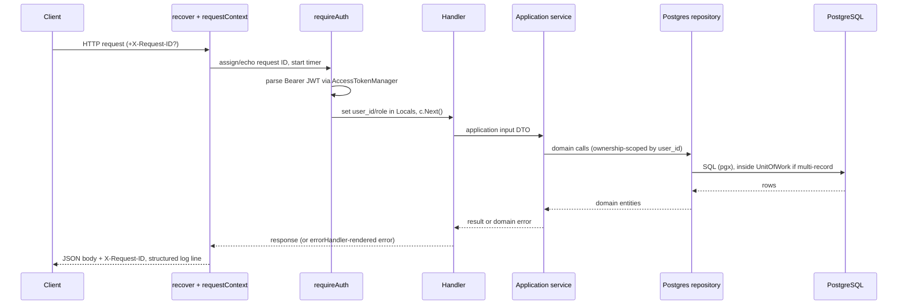

# System Architecture

Source: `docs/ARCHITECTURE.md`, confirmed against `services/api/internal/**` and `services/api/cmd/api/main.go`.

## Implementation status legend

- ✅ Implemented and verified in code
- 🚧 Partially implemented
- ◻ Planned (documented, no code yet)
- ⛔ Intentionally deferred (explicit product/architecture decision, not an oversight)

## System context

Only the Go API and PostgreSQL are implemented today. Redis and Mailpit exist in `compose.yaml` under the `platform` profile ("reserved for later worker and notification phases" per README) but nothing in `internal/` connects to them. See [[Background Jobs]].

## Architecture style — Clean Architecture, modular monolith

Dependency direction always points inward. **Confirmed by direct inspection**: `internal/domain` and `internal/application` import only `context`, standard library, and each other — no Fiber, pgx, Fx, JWT, or config imports anywhere in those packages. This matches the hard rule in `CLAUDE.md` and is enforced by convention (no lint rule currently checks it automatically).

See [[Repository Structure]] for the package layout and [[Dependency Injection]] for how Uber Fx assembles this graph.

## Modules (from `docs/ARCHITECTURE.md` §3)

| Module | Responsibility | Status |
|---|---|---|
| Identity | Users, credentials, sessions, refresh rotation | ✅ |
| Accounts | Financial accounts, balance views | ✅ |
| Categories | Default + user categories | ✅ |
| Ledger | Transactions, entries, reversals, idempotency | ✅ |
| Budgets | Periods, allocations, activation, summaries | 🚧 (no summary/consumption endpoint) |
| Bills | Recurring definitions, payment occurrences | 🚧 (create/list only, no "mark paid", monthly-only) |
| Goals | Savings goals, contributions | ✅ |
| Planning | Safe-to-spend, deterministic recommendations | ✅ (deterministic part); AI explanation ◻ |
| Admin | RBAC, feature flags, user status, audit logs | ⛔ (audit log storage exists; nothing else) |
| Platform | Config, database, logging, clock, IDs, security adapters | ✅ |

Each implemented module is documented in [[Backend Modules]].

## Request flow (authenticated endpoint)

Source: `internal/adapters/httpapi/server.go`. See [[Authorization and Ownership]] for the auth middleware detail and [[API Overview]] for the error envelope.

## Composition root and lifecycle

Uber Fx is used **only** in `internal/bootstrap` (32 providers) and `cmd/api/main.go` (7 lines: `bootstrap.New().Run()`). Graceful shutdown: `OnStop` calls Fiber's `ShutdownWithTimeout(cfg.ShutdownTimeout)` (default 10s), registered after the DB pool's own `OnStop` hook — so Fx runs stop hooks in reverse registration order, meaning HTTP finishes draining requests before the DB pool closes. Full detail in [[Dependency Injection]].

## Explicitly deferred (not gaps — documented boundaries)

Per README "Current boundary" and `docs/ARCHITECTURE.md` §11: mobile app, admin web, background worker (`cmd/worker`), notifications, exports, full reports, bank synchronization, and AI-provider integration are explicit later phases, not oversights. The deterministic recommendation engine is complete; an LLM may later add explanations only after deterministic validation (REC-007, still ◻).

## Related notes

- [[Repository Structure]]
- [[Backend Modules]]
- [[Dependency Injection]]
- [[Financial Ledger]]
- [[Database Model]]
- [[Implementation Status]]
- [[SakuPlan]]
