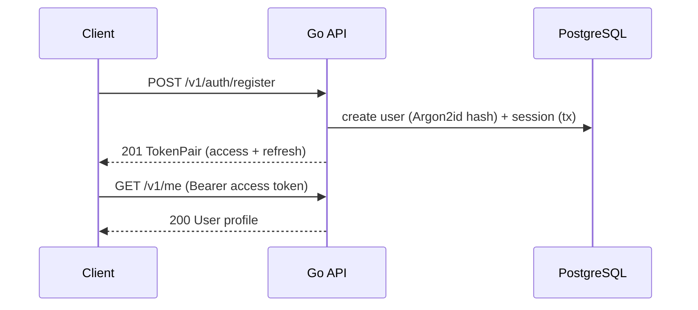
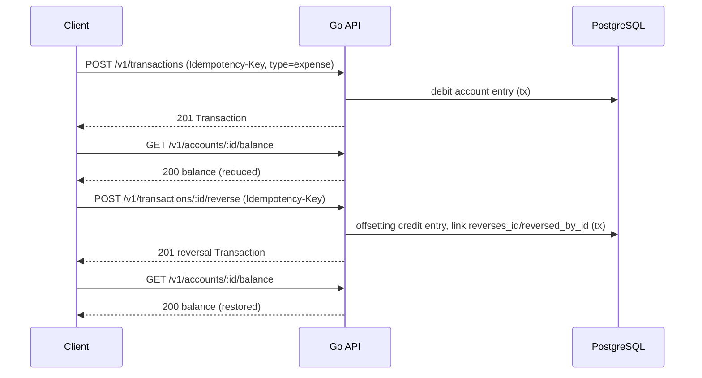

# User Flows

There is no dedicated user-flow document in the repository (`docs/PRD.md` describes product surfaces and personas but not step-by-step flows). The flows below are derived from the implemented API surface — see [[API Overview]] for the underlying endpoints — and represent what is mechanically possible today, not a designed UX.

## Registration and first login

Source: [[Authentication API]], [[Authentication and Sessions]].

## Recording an expense and reversing it

Source: [[Transactions API]], [[Financial Ledger]]. Verified against `TestTransactionAndReversalHTTPFlow` in `internal/adapters/httpapi/server_test.go`.

## Building a budget and checking safe-to-spend

1. `POST /v1/budgets` — create a draft with expected income, savings commitment, buffer, and category allocations.
2. `POST /v1/budgets/:id/activate` — activates only if `savings + buffer + allocations ≤ expected_income` (else `409 BUDGET_OVERALLOCATED`) and no other active period overlaps the date range.
3. `GET /v1/planning/safe-to-spend` — returns `liquid_balance − upcoming_bills − remaining_savings_commitment − minimum_buffer`, plus a daily figure and risk level.

Source: [[Budgets API]], [[Safe-to-Spend Engine]].

## Requesting a budget recommendation

1. `POST /v1/planning/recommendations` with income, fixed bills, debt, savings target, buffer, dependants, mode, locked allocations.
2. Response returns category allocations, savings commitment, buffer, warnings, and reason codes — computed by a pure deterministic function, no persistence.
3. The PRD's intended next step (REC-006, "apply a recommendation as a draft budget after explicit confirmation") is **not wired to any endpoint** — there is no "apply recommendation" API call today. A client would have to manually re-submit the recommendation's allocations as a `POST /v1/budgets` request.

Source: [[Budget Recommendation Engine]], [[Recommendations API]].

## Contributing to a savings goal

1. `POST /v1/goals` — create a goal with target amount, optional monthly commitment.
2. `POST /v1/goals/:id/contributions` (Idempotency-Key) — debits the chosen account and records a linked ledger transaction of type `adjustment`.

Source: [[Saving Goals API]].

## Flows described in the PRD but not yet buildable

Dashboard viewing, cash-flow reports, data export, notification preference management, AI explanation requests, and any admin/support workflow have no backing endpoints yet — see [[Remaining Work]].

## Related notes

- [[API Overview]]
- [[Product Requirements]]
- [[SakuPlan]]
